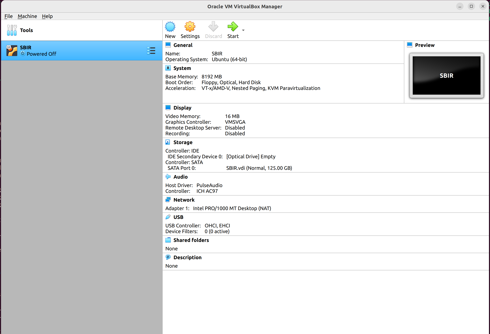
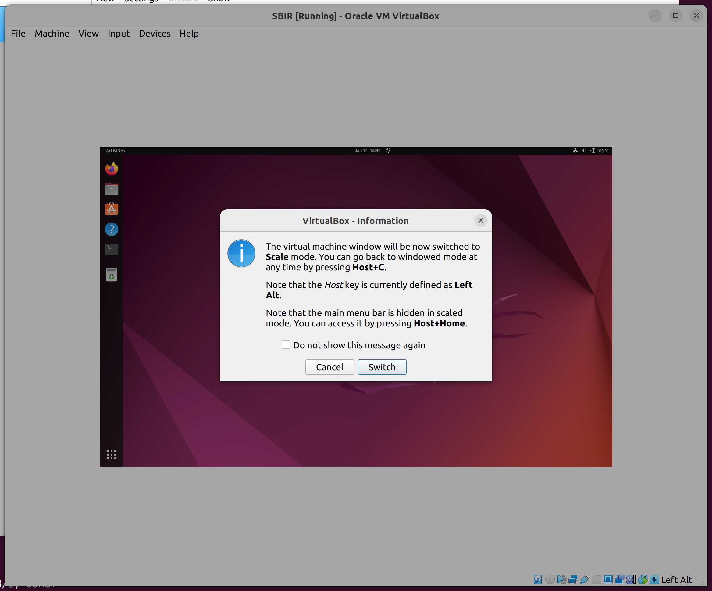
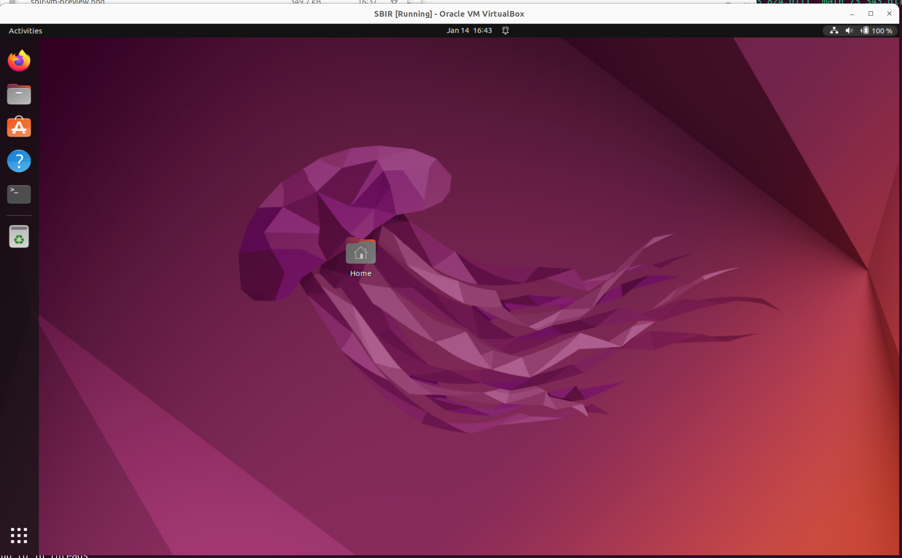

# Artifact Installation Method

Note: The virtual machine was created and tested using VirtualBox version 6.1 on Ubuntu 22.04.

## Getting the virtual machine 

1. Download and install [VirtualBox](https://www.virtualbox.org/). 
2. Download virtual machine file [SBIR.ova](). 
**Please note this is a large file and may take some time to download.**
3. Open VirtualBox.
4. Go to **File > Import Appliance...**
5. Find and select the downloaded virtual machine file (`SBIR.ova`). Click **"Continue"**.
6. Leave all the settings as they are and click **"Import"**.

Once the virtual machine is imported, it will appear in your VirtualBox Manager as **SBIR** as shown below.

You can now start the virtual machine by clicking the green **"Start"** arrow at the top of the VirtualBox Manager (see screenshot above).
If the machine boots up successfully you will see the screen as shown below. 
Please close the Autocapture keyword and mouse pointer integration pop-ups using the blue `x` icon. 

To resize the virtual machine window select **View -> Scaled Mode**. This would open a pop-up confirming 
you to switch to scaled mode as shown below. Select **Swich** in the pop-up.  

Finally, if everything goes well, you should see the resized virtual machine all set to use as shown below. 

### Waking up the virtual machine

If you are asked for a password to login to the virtual machine (e.g., if the VM goes 
to sleep or you logged out and need to login), please use the password **sbir**.
