# SBIR-Replication Package Artifact (ICSE 2023)

This is the artifact for the paper **Better Automatic Program Repair by Using Bug Reports and Tests Together**, 
in Proceedings of the 45th International Conference on Software Engineering (ICSE), 2023 by Manish Motwani and Yuriy Brun.

This artifact facilitates the use of:
- [**Blues**](https://github.com/LASER-UMASS/Blues),  a novel unsupervised information-Retrieval-based fault localization technique 
that uses bug reports to rank suspicious program statements.
- [**RAFL**](https://github.com/LASER-UMASS/RAFL), a novel unsupervised Rank Aggregation-based fault localization technique to combine results of multiple fault localization techniques.

## What is included in this artifact?

Our artifact includes the following:
1. SBFL: implementation of spectrum-based FL technique using GZoltar v1.7.2 and Ochiai ranking strategy. 
2. Blues: novel information-retrieval-based statement-level fault localization technique that requires no training data.
3. RAFL: novel unsupervised technique for combining multiple FL techniques.
4. SBIR: Using RAFL to combine Blues and SBFL using the Cross-entropy Monte Carlo algorithm and the Spearman footrule distance. 
5. Evaluation of SBFL, Blues, and SBIR on 815 defects from Defects4J v2.0.
6. Comparison of Blues with the state-of-the-art  (iFixR) and baseline (Vanilla BLUiR).
7. Comparison of SBIR with the underlying SBFL and Blues, and with the state-of-the-art. 
8. Code to execute three different program repair tools (Arja, SequenceR, and SimFix) customized to use precomputed FL results obtained from different FL techniques (SBFL, Blues,SBIR, and perfect FL) to repair Defects4J defects. 
9. Code to generate held-out evaluation test suites using EvoSuite that we use to assess the correctness of patches produced by the repair tools. 
10. The held-out test evaluation suites generated using 10 seeds for all the defects in Defects4J that are patched using any of the three repair tools. 
11. Code to evaluate the quality of the produced patches using held-out test suites.  
12. Manual correctness analysis of the patches produced by the three repair tools that passed all the tests in the held-out evaluation test suites.
13. Correct patches produced by the three repair tools using different FL techniques when attempted to repair 689 (129 for SequenceR) defects in Defects4J.
14. Analysis of how using using SBIR in the repair process improves repair quality and the effect of localization error on repair quality.  

## Where can I obtain the artifact components?

All the above listed artifacts, with the exception of the virtual machine file, are located in this repository.

Artifacts 1-7 in the list above are availble under [/home/sbir/SBIR-ReplicationPackage/FaultLocalization](https://github.com/LASER-UMASS/SBIR-ReplicationPackage/tree/main/FaultLocalization) directory.
Artifacts 8-13 in the list above are availble under [/home/sbir/SBIR-ReplicationPackage/AutomatedProgramRepair](https://github.com/LASER-UMASS/SBIR-ReplicationPackage/tree/main/AutomatedProgramRepair) directory.

## How do I install the artifact?

_Copied from INSTALL.md_

**Note:** The virtual machine was created and tested using VirtualBox version 6.1 on Ubuntu 22.04.
Make sure you have atleast 130 GB of free storage to download and execute the virtual machine.

### Getting the virtual machine 

1. Download and install [VirtualBox](https://www.virtualbox.org/). 
2. Download virtual machine file [SBIR.ova](https://umass-my.sharepoint.com/:u:/g/personal/mmotwani_umass_edu/EeJYzl5GmhpGoPFvwAYE0gQBZCDZS-i1EJckOcmiDiMjoQ?e=4%3apaT2Tg&at=9). 
**Please note this is a large file (~50 GB) and may take some time (15-20 min) to download.**
3. Open VirtualBox.
4. Go to **File > Import Appliance...**
5. Find and select the downloaded virtual machine file (`SBIR.ova`). Click **"Continue"**.
7. Click **Agree** in the Software License Agreement box.
8. Leave all the settings as they are and click **"Import"**. (This will take around 6-10 minutes.) 

Once the virtual machine is imported, it will appear in your VirtualBox Manager as **SBIR** as shown below.

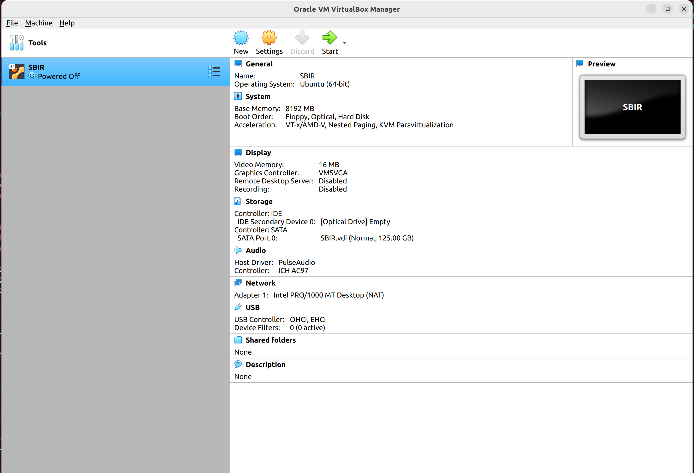

You can now start the virtual machine by clicking the green **"Start"** arrow at the top of the VirtualBox Manager (see screenshot above).

**Note:** If you get an error _Implementation of the USB 2.0 controller not found!_ then click on the orange gear icon of **Settings** at the top of the VirtualBox Manager (see screenshot above), select **USB** from the left pane in the settings box, and change USB controller selection from **USB 2.0** to **USB 1.1** by clicking the radio button of **USB 1.1**. Save this setting and now press **"Start"**. 

When the machine boots up successfully you will see the screen as shown below. 
Please close the **Autocapture keyword** and **mouse pointer integration** pop-ups using the blue `x` icon. 

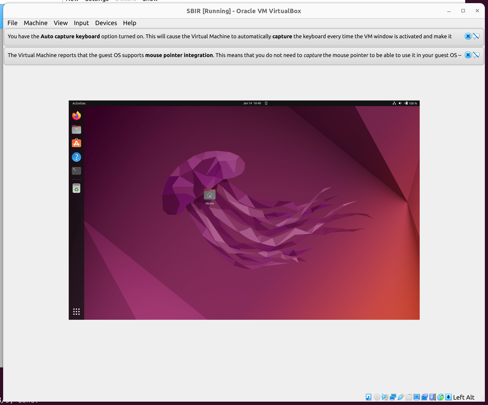

To resize the virtual machine window select **View -> Scaled Mode**. This would open a pop-up confirming 
you to switch to scaled mode as shown below. Select **Swich** in the pop-up.  

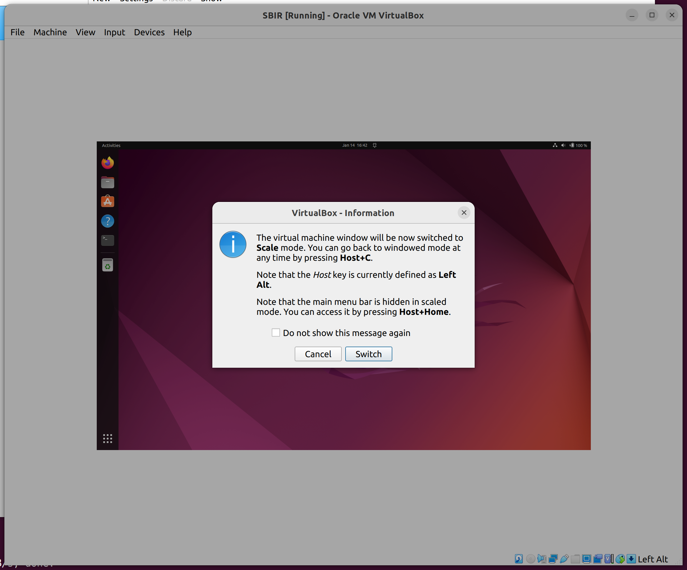

Finally, if everything goes well, you should see the resized virtual machine all set to use as shown below. 

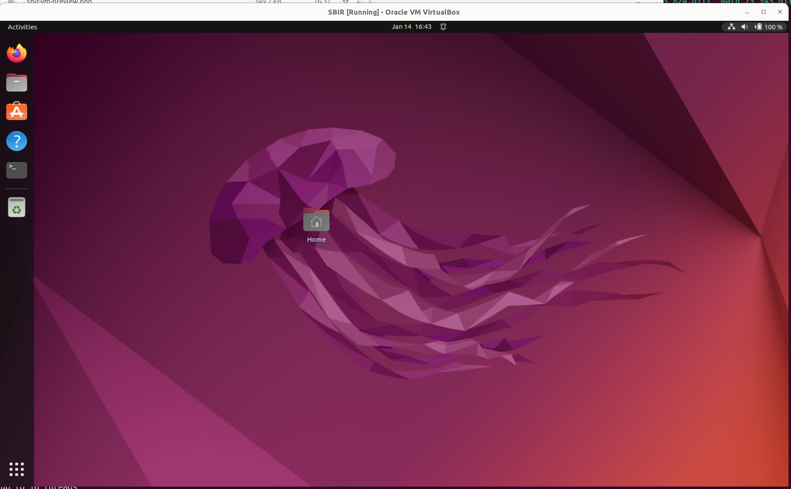

#### Waking up the virtual machine

If you are asked for a password to login to the virtual machine (e.g., if the VM goes 
to sleep or you logged out and need to login), please use the password **sbir**.

## How do I execute the artifact and replicate the published results?

Open the termial from using the favourites bar on the left as shown below. 

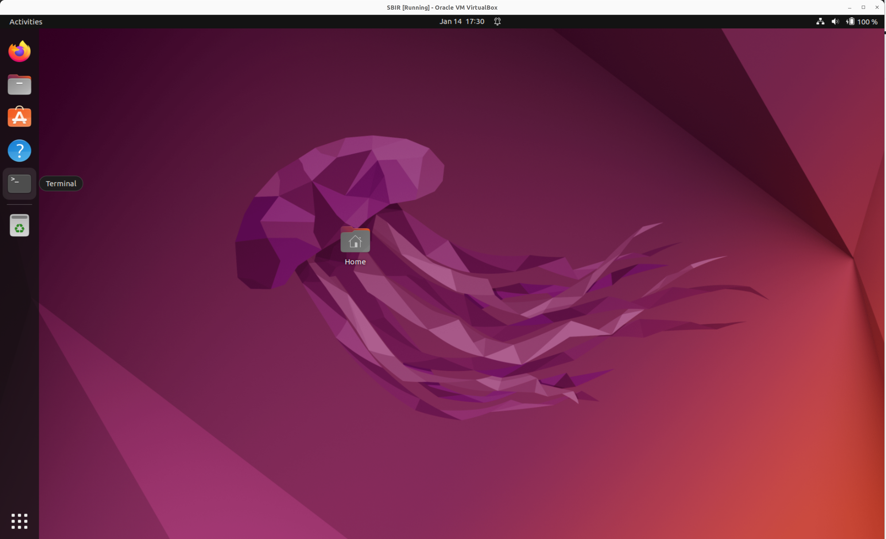

Type the command `ls` and make sure that you see the folder `SBIR-ReplicationPackage` listed in the output as shown below. 

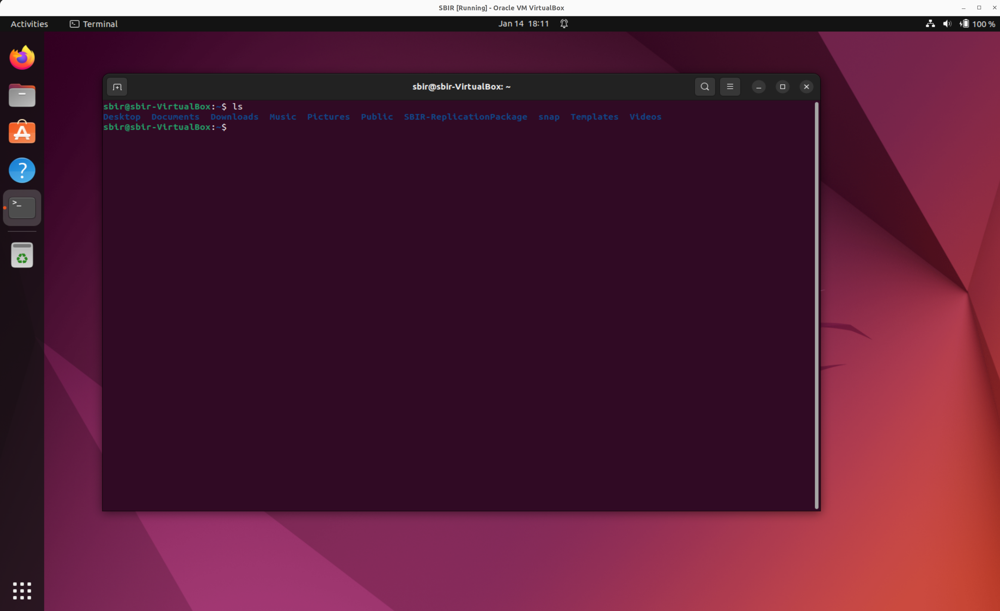

## SBFL Artifacts

We implement spectrum-based fault localization (SBFL) technique using GZoltar v1.7.2 and Ochiai ranking strategy. 
Our implementation is available in the [`/home/sbir/SBIR-ReplicationPackage/FaultLocalization/src/sbfl`](https://github.com/manishmotwani3/SBIR-ReplicationPackage/tree/main/FaultLocalization/src/sbfl) directory. 

To execute our SBFL implementation on an example defect (Chart 1) in the VM, run the following commands as shown below. 
This would take ~1 min to finish.  

1. `cd /home/sbir/SBIR-ReplicationPackage/FaultLocalization/src/sbfl/src`
2. `bash computeSBFL.sh Chart 1`

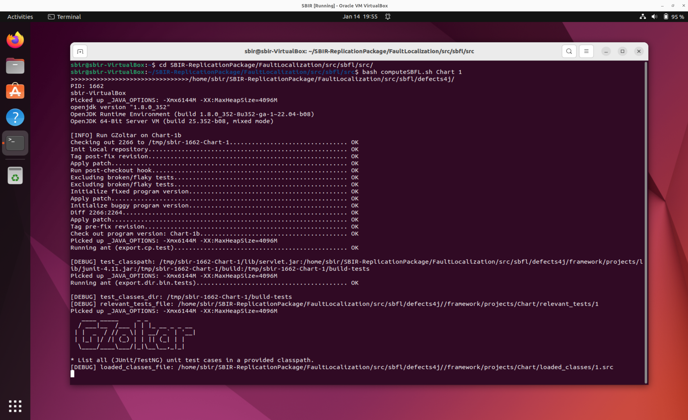

At the end of the execution, the paths to the generated files will be displayed as shown below. 

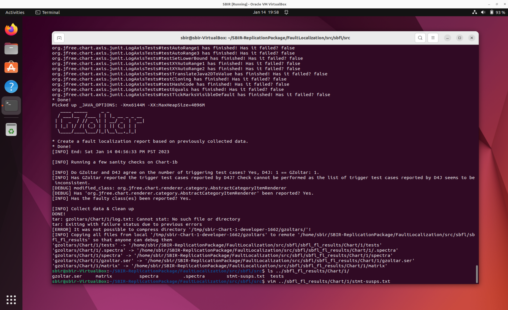

The suspicious statements and their suspiciousness scores will be stored in the `../sbfl_fl_results/Chart/1/stmt-susps.txt` file as shown below. 

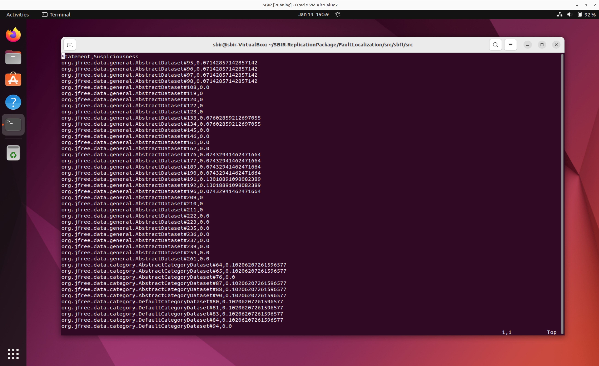

The pre-computed SBFL results for the 815 defects are already stored in [`/home/sbir/SBIR-ReplicationPackage/FaultLocalization/data/SBFL_results`](https://github.com/manishmotwani3/SBIR-ReplicationPackage/tree/main/FaultLocalization/data/SBFL_results) directory.

#### Figure 1: SBFL vs SBFL using older GZoltar versions.

We compare the FL performance of our SBFL implementation with published results [49] of SBFL implemented using older GZoltar versions 
on the 395 defects in Defects4J.

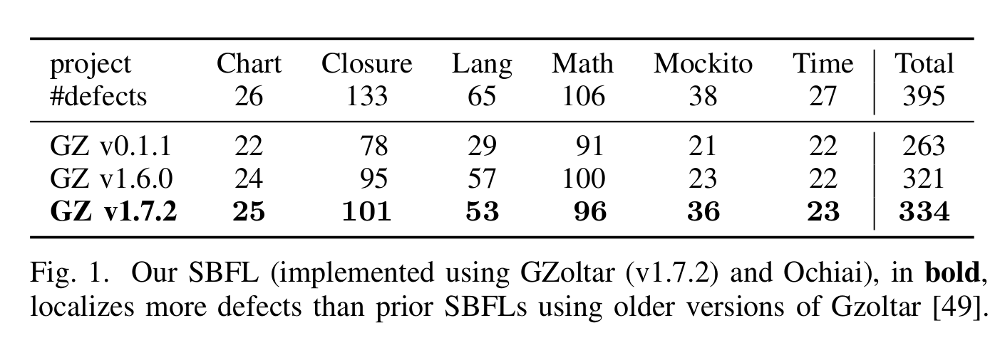

To replicate the above results, please execute the following commands. 

1. `cd /home/sbir/SBIR-ReplicationPackage/FaultLocalization/`
2. `python src/computeFLperformance.py data/groundTruthD4J.csv data/395defects.txt data/SBFL_results "chart" 10000`
3. `python src/computeFLperformance.py data/groundTruthD4J.csv data/395defects.txt data/SBFL_results "closure" 10000`
4. `python src/computeFLperformance.py data/groundTruthD4J.csv data/395defects.txt data/SBFL_results "lang" 10000`
5. `python src/computeFLperformance.py data/groundTruthD4J.csv data/395defects.txt data/SBFL_results "math" 10000`
6. `python src/computeFLperformance.py data/groundTruthD4J.csv data/395defects.txt data/SBFL_results "mockito" 10000`
7. `python src/computeFLperformance.py data/groundTruthD4J.csv data/395defects.txt data/SBFL_results "time" 10000`
8. `python src/computeFLperformance.py data/groundTruthD4J.csv data/395defects.txt data/SBFL_results "" 10000`

The output will be printed on the terminal as shown below. Please ignore the Avg EXAM scores. 

**This replicates the results presented in the Figure 1 of the paper.** 

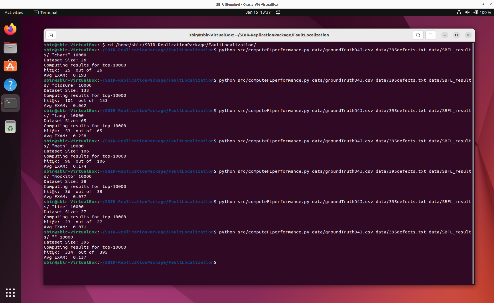

##  Blues Artifacts

Blues is our novel information-retrieval-based statement-level fault localization technique that localizes defects using bug reports. 
The implementation of blues that can be reused and extended by other researchers is available at 
[Blues-GitHub](https://github.com/LASER-UMASS/Blues).

We next illustrate Blues using an example defect (Chart 1) on the VM. The executable version of Blues used in VM is available in [`/home/sbir/SBIR-ReplicationPackage/FaultLocalizationsrc/blues`](https://github.com/manishmotwani3/SBIR-ReplicationPackage/tree/main/FaultLocalization/src/blues) directory. 
To execute Blues in the VM, run the following commands as shown below. This would take ~1 min to finish. 

1. `cd /home/sbir/SBIR-ReplicationPackage/FaultLocalization/src/blues`
2. `bash delete_all_results.sh`
3. `java -jar blues.jar Chart_1`

As shown below, during the execution Blues will display the bug report URL it crawls the bug report from (e.g., `https://sourceforge.net/p/jfreechart/bugs/983` for Chart 1) and the source code files (`Processing susps file:`)
it parses to extract the 57 types of Java AST statements (`#statements extracted`) that it uses in retrieval.   

At the end of the execution, the results are stored in the six sub-folders created under `blues_configuration_results` directory. 
Five corresponding to `m` = {1, 25, 50, 100, All} and `ScoreFn=high` and one corresponding to `m=all`, `ScoreFn=wted`) as shown below.

The above execution also dumps the statement-level BLUiR (vanilla BLUiR) results in the `statement_level_BLUiR_results` directory that do not consider 
file scores as shown below. 

To combine the six Blues results into Blues ensemble, run the following command. This will take less than 5 seconds to finish.

1. `cd /home/sbir/SBIR-ReplicationPackage/FaultLocalization/src/blues`
2. `python combineBluesUsingMaxScoreConsensus.py ../../data/815defects.txt blues_configuration_results blues_results`

At the end of the execution, the generated files are stored in `blues_results` directory as shown below. 

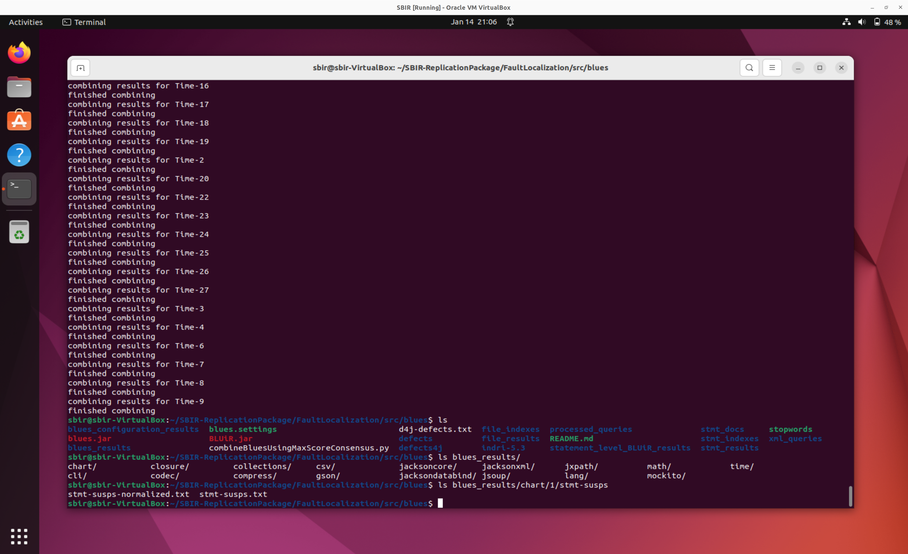

The suspicious statements and their suspiciousness scores are stored in the `blues_results/chart/1/stmt-susps.txt` and 
`blues_results/chart/1/stmt-susps-normalized.txt` files (where the `stmt-susps-normalized.txt` stores suspiciousness 
scores normalized between 0.0 to 1.0 of the ranked statements) as shown below. 

The pre-computed Blues configuration results for 815 defects are stored in [`/home/sbir/SBIR-ReplicationPackage/FaultLocalization/data/blues_configuration_results`](https://github.com/manishmotwani3/SBIR-ReplicationPackage/tree/main/FaultLocalization/data/blues_configuration_results) directory.

The pre-computed vanilla BLUiR results for 815 defects are stored in [`/home/sbir/SBIR-ReplicationPackage/FaultLocalization/data/statement_level_BLUiR_results`](https://github.com/manishmotwani3/SBIR-ReplicationPackage/tree/main/FaultLocalization/data/statement_level_BLUiR_results) directory.

The pre-computed Blues ensemble results for 815 defects are stored in [`/home/sbir/SBIR-ReplicationPackage/FaultLocalization/data/blues_results`](https://github.com/manishmotwani3/SBIR-ReplicationPackage/tree/main/FaultLocalization/data/blues_results) directory.

#### Figure 4: Blues vs iFixR.

We compare Blues with iFixR, a bug report-based program repair tool that internally uses statement-level IR-based FL. 
The iFixR FL results available at [iFixR-results](https://github.com/TruX-DTF/iFixR/tree/master/data/stmtLoc) contain 
multiple statements with the same rank and multiple ranks for the same statement. We break ties by assigning the highest
possible rank to each statement. 

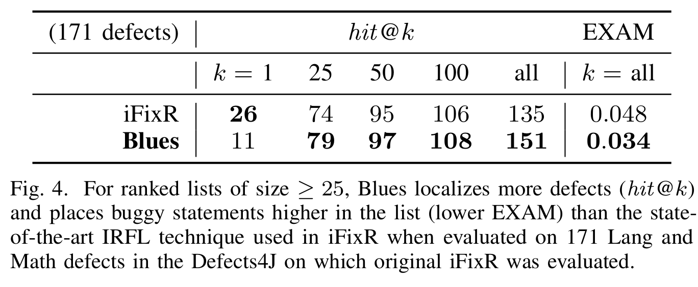

To create iFixR dataset, execute the following commands. This will take less than 1 minute.

1. `cd /home/sbir/SBIR-ReplicationPackage/FaultLocalization`
2. `python src/formatiFixRresults.py data/iFixR_defects.txt data/stmtLoc data/iFixR_results`

The re-formatted iFixR results are stored in [`/home/sbir/SBIR-ReplicationPackage/FaultLocalization/data/iFixR_results`](https://github.com/manishmotwani3/SBIR-ReplicationPackage/tree/main/FaultLocalization/data/iFixR_results) directory.

To compare the FL performance of Blues with iFixR on Lang and Math project defects on which iFixR was evaluated execute the following commands.
The output is printed on the terminal as shown below. Please consider the `hit@k` scores for all `top-k` while `Avg EXAM` scores for `top-10000` only.  

1. `cd /home/sbir/SBIR-ReplicationPackage/FaultLocalization`
2. `python src/computeFLperformance.py data/groundTruthD4J.csv data/171defects.txt data/iFixR_results "" all`
3. `python src/computeFLperformance.py data/groundTruthD4J.csv data/171defects.txt data/blues_results "" all`

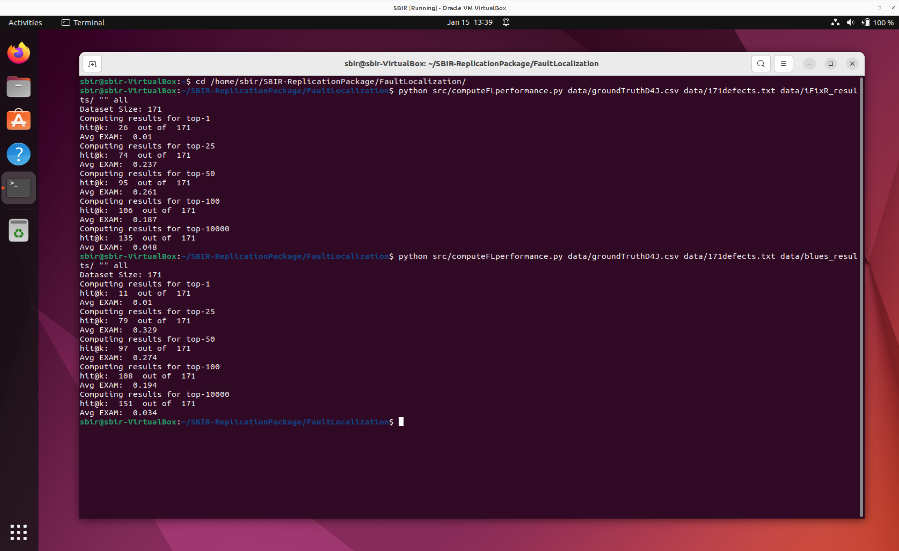

**This replicates the results presented in the Figure 4 of the paper.** 

#### Figure 5: Blues vs Vanilla BLUiR.

Next, we compare the FL performance of Blues with statement-level BLUiR (vanilla BLUiR) considered as a baseline on the 815 defects. 

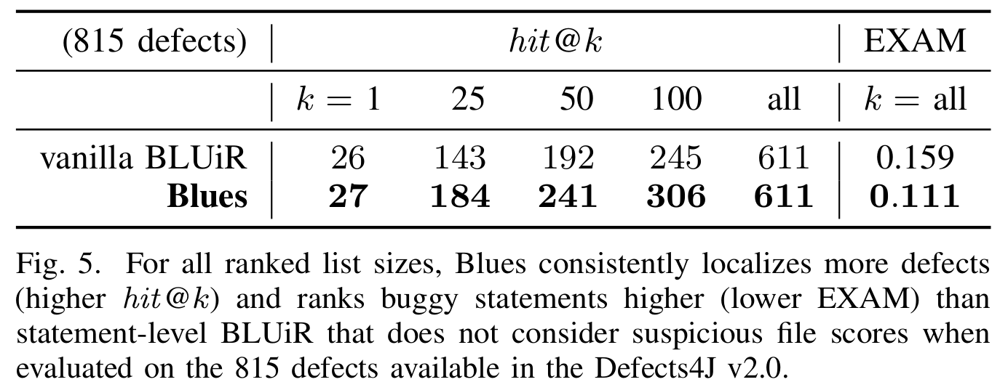

To  compare the FL of Blues with vanilla BLUiR, please execute the following commands.
The output is printed on the terminal as shown below.  Please consider the `hit@k` scores for all `top-k` while `Avg EXAM` scores for `top-10000` only.

1. `cd /home/sbir/SBIR-ReplicationPackage/FaultLocalization`
2. `python src/computeFLperformance.py data/groundTruthD4J.csv data/815defects.txt data/statement_level_BLUiR_results/ "" all`
3. `python src/computeFLperformance.py data/groundTruthD4J.csv data/815defects.txt data/blues_results/ "" all`

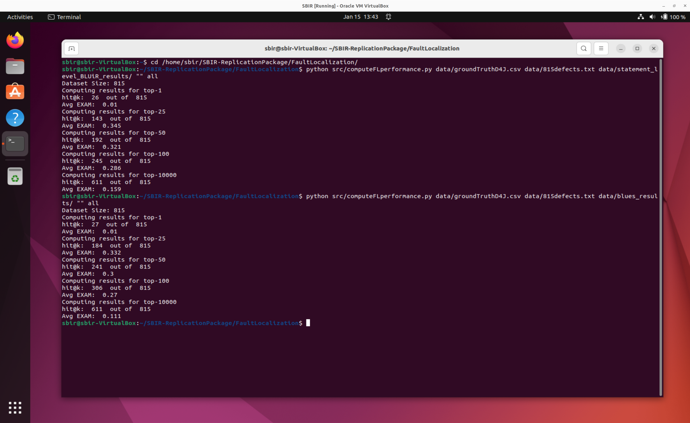

**This replicates the results presented in the Figure 5 of the paper.** 

##  RAFL Artifacts

To combine the SBFL and Blues fault localization results we develop RAFL, a tool that uses unsupervised Rank Aggregation-based algorithms 
and does not require any training. The source code that of RAFL that can be reused and extended by other researchers is available at 
[RAFL-GitHub](https://github.com/LASER-UMASS/RAFL). 

We use RAFL to develop SBIR, an instance of RAFL that combines SBFL and Blues using the Cross-Entropy Monte Carlo algorithm and Spearman footrule distance. The implementation of SBIR is available in [`/home/sbir/SBIR-ReplicationPackage/FaultLocalization/src/rafl`](https://github.com/manishmotwani3/SBIR-ReplicationPackage/tree/main/FaultLocalization/src/rafl) directory. We used 10 random seeds {1, 7, 47, 160, 561, 630, 657, 754, 828, 956} to 
combine the SBFL and Blues results and compute SBIR results. To run SBIR using an example defect (Chart 1) on the VM, please execute the following commands. This will take around 5-6 minutes to finish. 

1. `cd /home/sbir/SBIR-ReplicationPackage/FaultLocalization/src/rafl`
2. `export JAVA_HOME=/usr/lib/jvm/java-8-openjdk-amd64/`
3. `export R_HOME=/usr/lib/R/`
4. `export LD_LIBRARY_PATH=/home/sbir/R/x86_64-pc-linux-gnu-library/4.1/rJava/jri:$LD_LIBRARY_PATH`
5. `java -Djava.library.path=.:/home/sbir/R/x86_64-pc-linux-gnu-library/4.1/rJava/jri -jar rafl.jar Chart_1 2 /home/sbir/SBIR-ReplicationPackage/FaultLocalization/data/blues_results/chart/1/stmt-susps.txt /home/sbir/SBIR-ReplicationPackage/FaultLocalization/data/SBFL_results/chart/1/stmt-susps.txt 1 10000`

After launching the RAFL, you should see the **R Graphics** window showing the execution of RAFL as shown below.
This will take 94 iterations to finish.

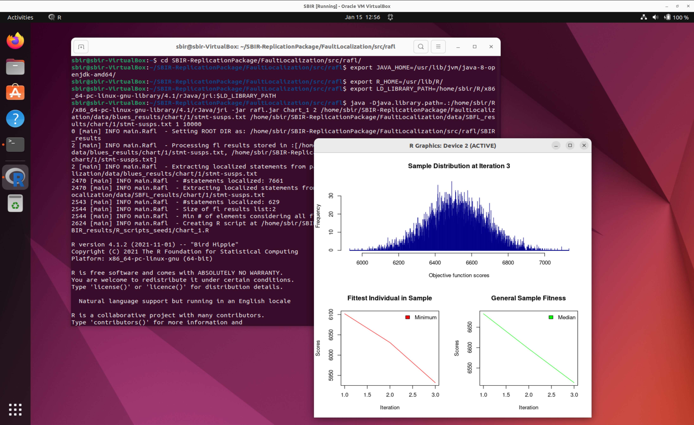

At the end of the execution, RAFL displays the path of the final result (e.g., `/home/sbir/SBIR-ReplicationPackage/FaultLocalization/src/rafl/SBIR_results/sbir_seed1/chart/1/stmt-susps.txt`) and the total execution time it took to perform the computation as shown below. 

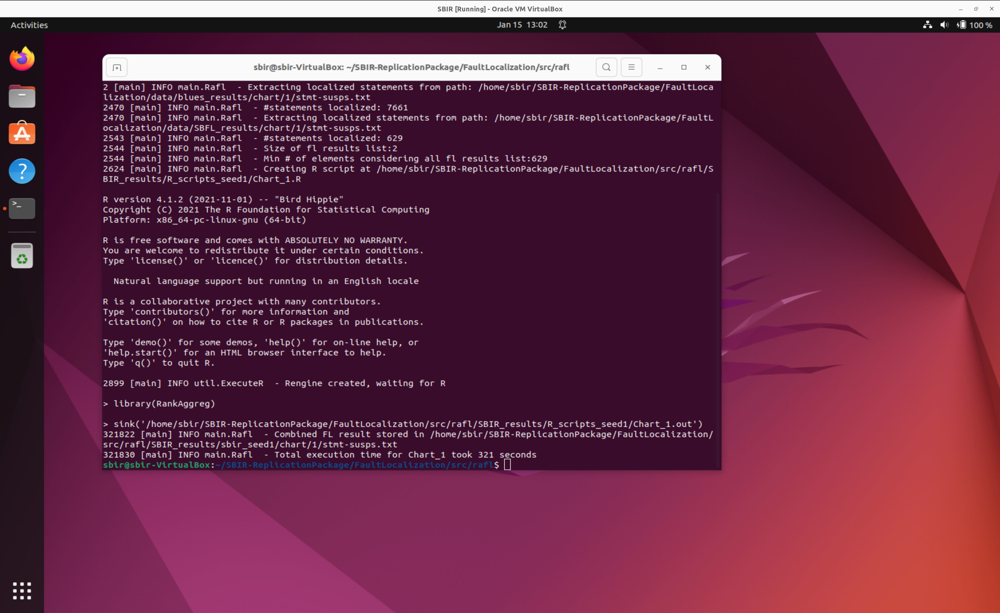

The suspicious statements and their suspiciousness scores are stored in the file `/home/sbir/SBIR-ReplicationPackage/FaultLocalization/src/rafl/SBIR_results/sbir_seed1/chart/1/stmt-susps.txt` as shown below. 

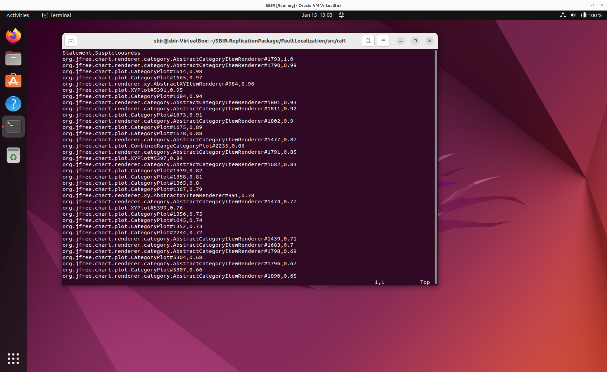

The pre-computed SBIR results for 815 defects using 10 random seeds are available in [`/home/sbir/SBIR-ReplicationPackage/FaultLocalization/data/SBIR_results`](https://github.com/manishmotwani3/SBIR-ReplicationPackage/tree/main/FaultLocalization/data/SBIR_results) directory.

#### Figure 6: SBIR vs underlying SBFL and Blues.

We compare the FL performance of SBIR with the underlying SBFL and Blues on 815 defects. 

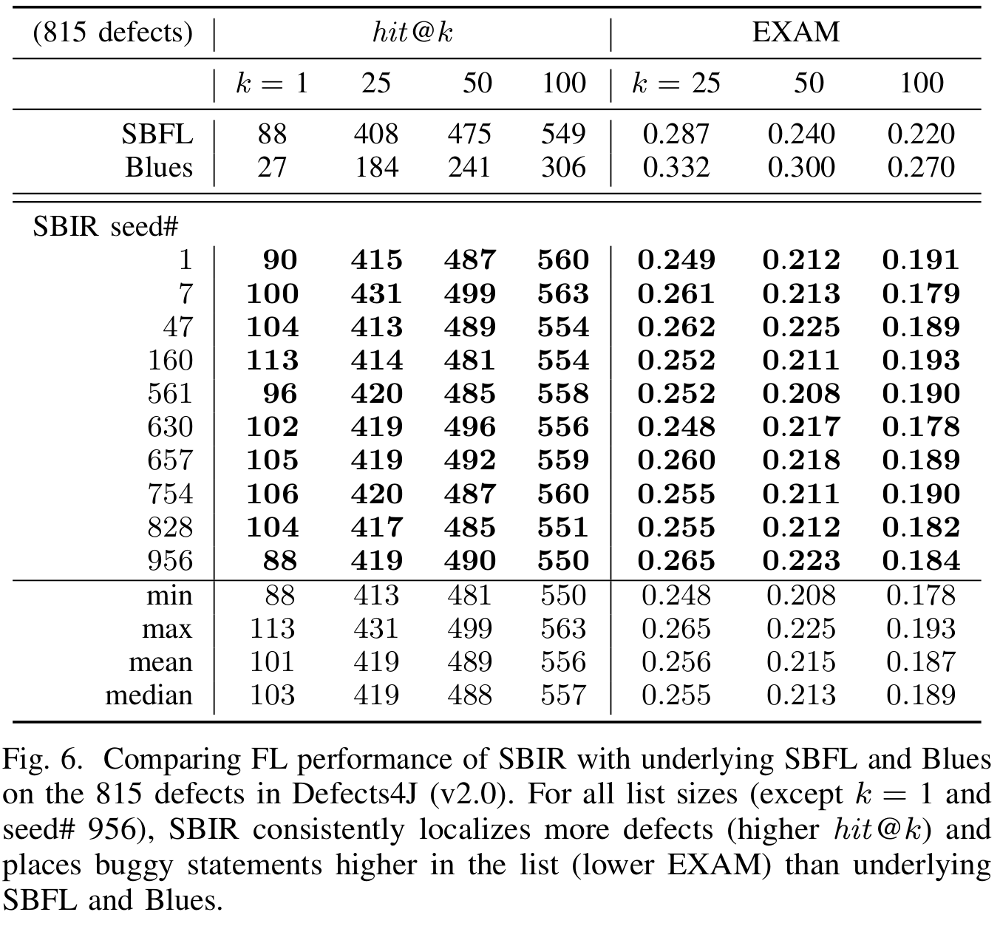

To replicate these results, please use the following commands.

1. `cd /home/sbir/SBIR-ReplicationPackage/FaultLocalization/`
2. `python src/computeFLperformance.py data/groundTruthD4J.csv data/815defects.txt data/SBFL_results/ "" "1,25,50,100"`
3. `python src/computeFLperformance.py data/groundTruthD4J.csv data/815defects.txt data/blues_results/ "" "1,25,50,100"`
4. `python src/computeFLperformance.py data/groundTruthD4J.csv data/815defects.txt data/SBIR_results/sbir_seed<n> "" "1,25,50,100"` 
where `<n>` is one of {1, 7, 47, 160, 561, 630, 657, 754, 828, 956} 

The output will be printed on the terminal as shown below. Please ignore the `Avg EXAM` scores displayed for `top-1`.   

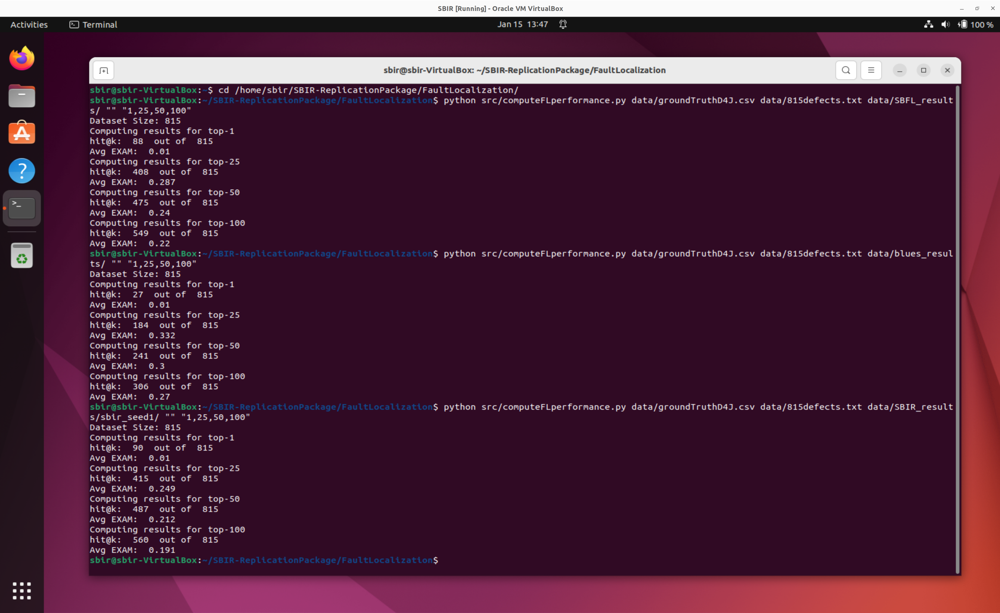

We compute the `min`, `max`, `mean`, and `median` using the [spreadsheet](https://docs.google.com/spreadsheets/d/1UpGE-XLcun5tmlqPwMV_w5Ow-cU4dHkjnKk9M6oFsnQ/edit?usp=sharing). 

**This replicates the results presented in the Figure 6 of the paper.** 

#### Figure 7: SBIR vs 9 standalone FL techniques.

We compare SBIR with the FL results of 9 standalone FL techniques whose results are extracted from the annotated dataset released by [CombineFL](https://damingz.github.io/combinefl/index.html). These results are extracted using the script [`/home/sbir/SBIR-ReplicationPackage/FaultLocalization/src/extractResultsFromJson.py`](https://github.com/LASER-UMASS/SBIR-ReplicationPackage/blob/main/FaultLocalization/src/extractResultsFromJson.py), and are available in [`/home/sbir/SBIR-ReplicationPackage/FaultLocalization/data/nine_standalone_fl_tools_results`](https://github.com/manishmotwani3/SBIR-ReplicationPackage/tree/main/FaultLocalization/data/nine_standalone_fl_tools_results) directory. 

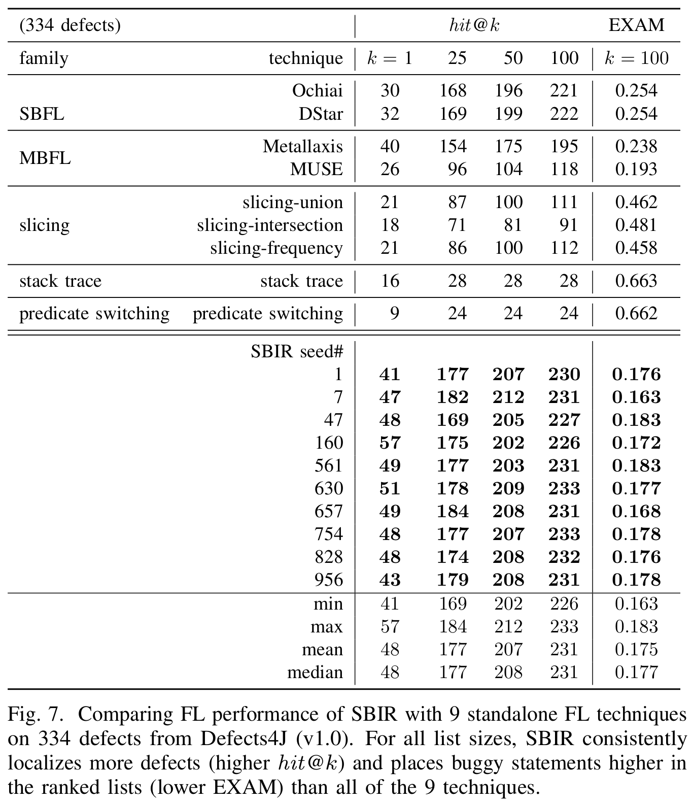

To compare the FL performance of SBIR with these 9 FL tools on 334 defects for which the results of the 9 tools and SBIR are available, please use the following commands. 

1. `cd /home/sbir/SBIR-ReplicationPackage/FaultLocalization/`
2. `python src/computeFLperformance.py data/groundTruthD4J.csv data/334defects.txt data/nine_standalone_fl_tools_results/ochiai/ "" "1,25,50,100"`
3. `python src/computeFLperformance.py data/groundTruthD4J.csv data/334defects.txt data/nine_standalone_fl_tools_results/dstar/ "" "1,25,50,100"`
4. `python src/computeFLperformance.py data/groundTruthD4J.csv data/334defects.txt data/nine_standalone_fl_tools_results/metallaxis/ "" "1,25,50,100"`
5. `python src/computeFLperformance.py data/groundTruthD4J.csv data/334defects.txt data/nine_standalone_fl_tools_results/muse/ "" "1,25,50,100"`
6. `python src/computeFLperformance.py data/groundTruthD4J.csv data/334defects.txt data/nine_standalone_fl_tools_results/slicing_union/ "" "1,25,50,100"`
7. `python src/computeFLperformance.py data/groundTruthD4J.csv data/334defects.txt data/nine_standalone_fl_tools_results/slicing_intersection/ "" "1,25,50,100"`
8. `python src/computeFLperformance.py data/groundTruthD4J.csv data/334defects.txt data/nine_standalone_fl_tools_results/slicing_frequency/ "" "1,25,50,100"`
9. `python src/computeFLperformance.py data/groundTruthD4J.csv data/334defects.txt data/nine_standalone_fl_tools_results/stacktrace/ "" "1,25,50,100"`
10. `python src/computeFLperformance.py data/groundTruthD4J.csv data/334defects.txt data/nine_standalone_fl_tools_results/predicateswitching/ "" "1,25,50,100"`
11. `python src/computeFLperformance.py data/groundTruthD4J.csv data/334defects.txt data/SBIR_results/sbir_seed<n> "" "1,25,50,100"` 
where `<n>` is one of {1, 7, 47, 160, 561, 630, 657, 754, 828, 956} 

The output will be printed on the terminal as shown below.

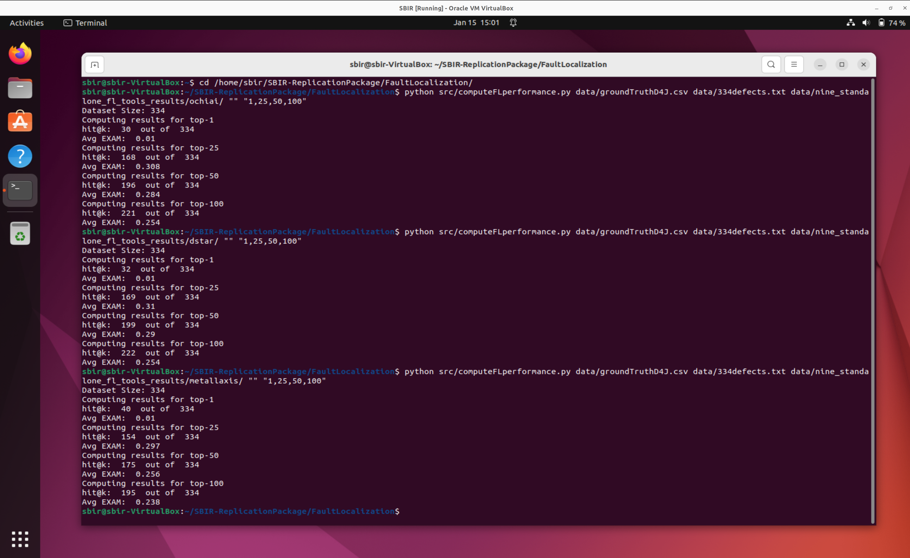

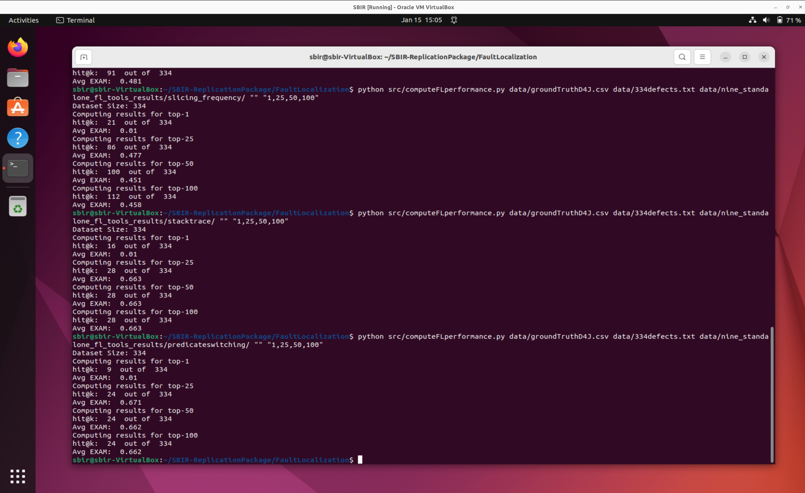

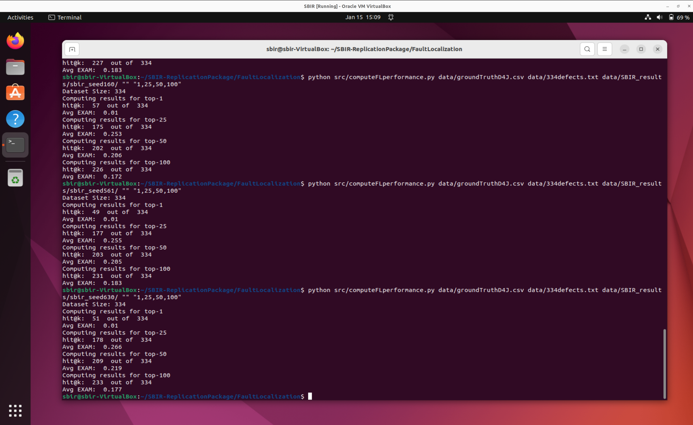

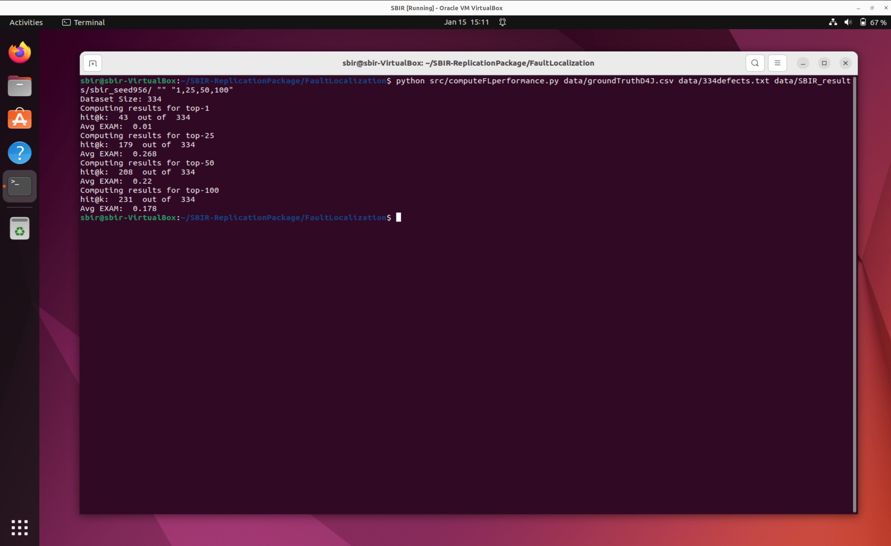

We compute the `min`, `max`, `mean`, and `median` using the [spreadsheet](https://docs.google.com/spreadsheets/d/1UpGE-XLcun5tmlqPwMV_w5Ow-cU4dHkjnKk9M6oFsnQ/edit#gid=1699170105).

**This replicates the results presented in the Figure 7 of the paper.** 

#### Figure 8: SBIR (RAFL) vs SBIR (RankSVM).

Next, we compare the results of SBIR computed using RAFL with the results of combining SBFL and Blues using the supervised 
RankSVM technique. To implement SBIR using RankSVM, we customize [CombineFL](https://damingz.github.io/combinefl/index.html) source code
to use 815 defects. The details about the customized source code, data, and instructions to conduct these experiments is available in the [`/home/sbir/SBIR-ReplicationPackage/FaultLocalization/src/sbir_vs_ranksvm`](https://github.com/manishmotwani3/SBIR-ReplicationPackage/tree/main/FaultLocalization/src/sbir_vs_ranksvm) directory.
However, running these experiments from scract can take a few hours and require more computational requirements than is supported by the VM therefore, we provide the pre-trained model and results in the VM that we use to replicate the following results we present in our paper. 

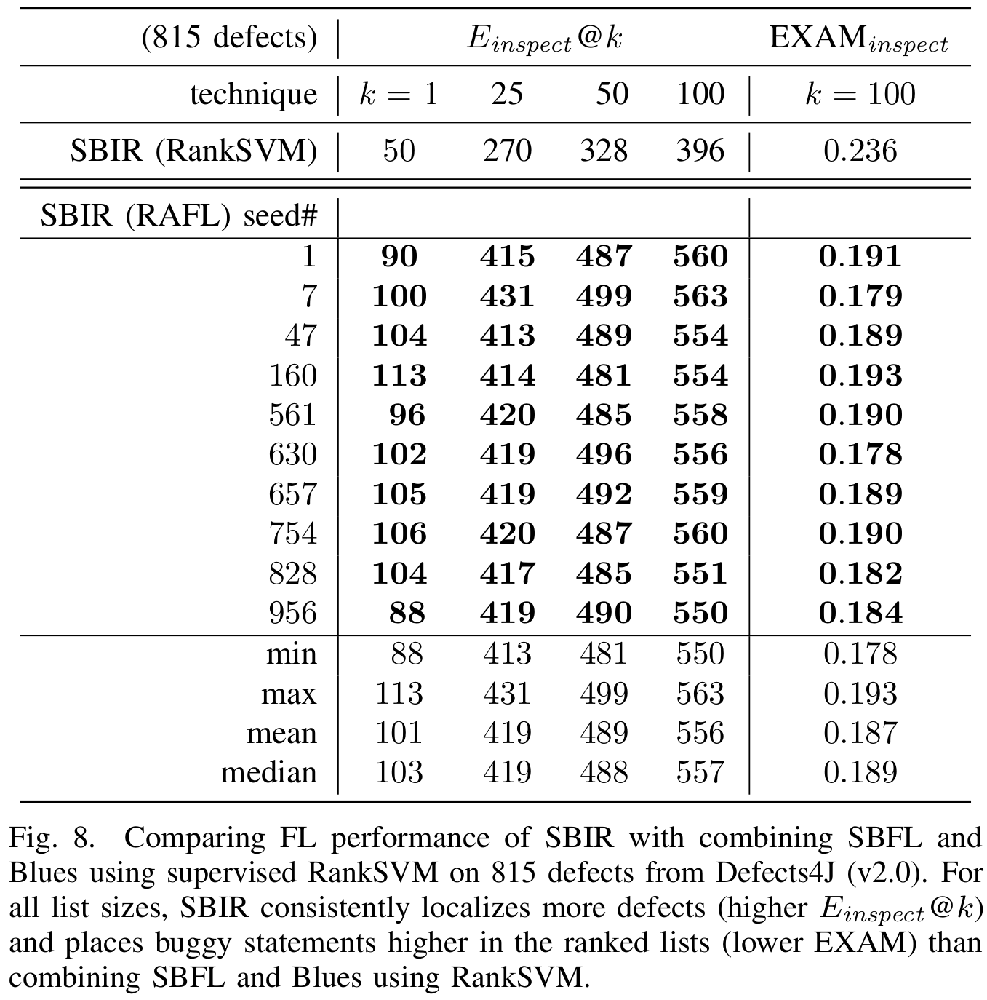

To compare the FL performance of SBIR computed using RankSVM with SBIR computed using RAFL on the 815 defects, please execute the following commands.

1. `cd  /home/sbir/SBIR-ReplicationPackage/FaultLocalization/src/sbir_vs_ranksvm`
2. `bash evaluateRankSVM.sh`
3. `bash evaluateSBIR.sh`

The output will be printed on the terminal as shown below.

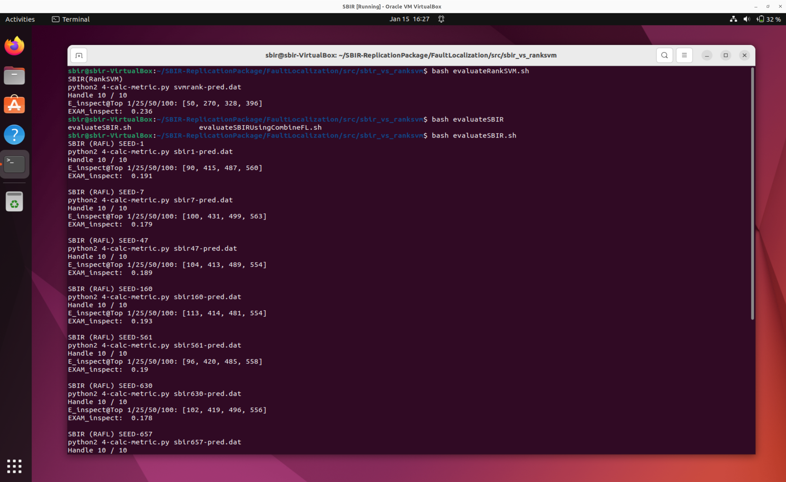

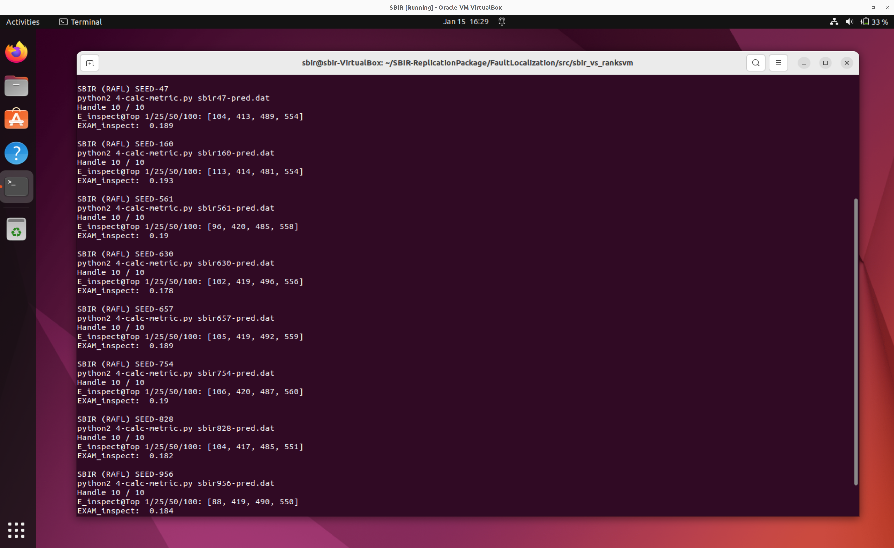

We compute the `min`, `max`, `mean`, and `median` using the [spreadsheet](https://docs.google.com/spreadsheets/d/1UpGE-XLcun5tmlqPwMV_w5Ow-cU4dHkjnKk9M6oFsnQ/edit#gid=84127064).

**This replicates the results presented in the Figure 8 of the paper.** 

##  Automated Program Repair (APR) Artifacts

### Repair tools customized to take pre-computed FL results

To analyze the affect of using SBIR on repair quality, our study customizes three existing repair tools (Arja, SequenceR, and SimFix) to use pre-computed fault localization results obtained using SBFL, Blues, SBIR, and perfect FL. The customized implementation of these repair tools along with the documentation of executing them are available in the respective directories (`arja`, `simfix`, and `sequencer`) under the [/home/sbir/SBIR-ReplicationPackage/AutomatedProgramRepair/src/](https://github.com/LASER-UMASS/SBIR-ReplicationPackage/tree/main/AutomatedProgramRepair/src) directory. 

We executed these repair tools on the Defects4J defects with a 5 hour timeout per defect using a 50-node cluster where each node had 128GB of RAM and 200GB of local SSD. As conducting these experiments requires large computational requirements they cannot be run on the VM. We provide the patches produced by the repair tools using different FL techniques and their assessment that we present in our paper as described below. 

### Automated patch quality assessment 

To assess the quality of the automatically produced patches, we used 10 held-out evaluation test suites generated per defect using EvoSuite with a search budget of 12 minutes (720 sec) per seed, for all
the defects that were patched by any of the three repair tools we consider.
The code to generate the held-out evaluation test suites is available at [/home/sbir/SBIR-ReplicationPackage/AutomatedProgramRepair/src/generateEvaluationTests.sh](https://github.com/LASER-UMASS/SBIR-ReplicationPackage/blob/main/AutomatedProgramRepair/src/generateEvaluationTests.sh) and the generated test suites we used are
available at [/home/sbir/SBIR-ReplicationPackage/AutomatedProgramRepair/data/all_eval_tests](https://github.com/LASER-UMASS/SBIR-ReplicationPackage/tree/main/AutomatedProgramRepair/data/all_eval_tests). 
The code used to assess the quality of the produced patches using the generated test suites is available at [evaluateGeneratedPatchesIn10SubTestSuites.py](https://github.com/LASER-UMASS/JavaRepair-replication-package/blob/master/src/patch-quality-assessment/evaluateGeneratedPatchesIn10SubTestSuites.py).

### Manual patch quality assessment

When an automatically produced patch passed all the held-out evaluation tests, we manually inspected that patch and compared it with the developer-written patch provided in the Defects4J benchmark for all the defects. 

The file [/home/sbir/SBIR-ReplicationPackage/AutomatedProgramRepair/data/patches/arja/correctness_analysis.txt](https://github.com/LASER-UMASS/SBIR-ReplicationPackage/blob/main/AutomatedProgramRepair/data/patches/arja/correctness_analysis.txt) contains the manual assessment of Arja patches. 

The file [/home/sbir/SBIR-ReplicationPackage/AutomatedProgramRepair/data/patches/sequencer/correctness_analysis.txt](https://github.com/LASER-UMASS/SBIR-ReplicationPackage/blob/main/AutomatedProgramRepair/data/patches/sequencer/correctness_analysis.txt) contains the manual assessment of SequenceR patches. 

The file [/home/sbir/SBIR-ReplicationPackage/AutomatedProgramRepair/data/patches/simfix/correctness_analysis.txt](https://github.com/LASER-UMASS/SBIR-ReplicationPackage/blob/main/AutomatedProgramRepair/data/patches/simfix/correctness_analysis.txt) contains the manual assessment of SimFix patches.

### Correct patches produced by the three repair tools

After manually inspecting all the produced patches, we stored the patches that we found to be correct.  

The patches produced by Arja are available in [/home/sbir/SBIR-ReplicationPackage/AutomatedProgramRepair/data/patches/arja/correct_patches](https://github.com/LASER-UMASS/SBIR-ReplicationPackage/tree/main/AutomatedProgramRepair/data/patches/arja/correct_patches) directory. 

The patches produced by SequenceR are available in [/home/sbir/SBIR-ReplicationPackage/AutomatedProgramRepair/data/patches/sequencer/correct_patches](https://github.com/LASER-UMASS/SBIR-ReplicationPackage/tree/main/AutomatedProgramRepair/data/patches/sequencer/correct_patches) directory. 

The patches produced by SequenceR are available in [/home/sbir/SBIR-ReplicationPackage/AutomatedProgramRepair/data/patches/simfix/correct_patches](https://github.com/LASER-UMASS/SBIR-ReplicationPackage/tree/main/AutomatedProgramRepair/data/patches/simfix/correct_patches) directory. 

#### Figure 9: Comparing repair quality of Arja, SequenceR, and SimFix when using different fault localization techniques. 

Finally, we compare the quaility of the three repair tools in terms of the number of defects pactched correctly and also analyze the affect of localization error as shown below. 

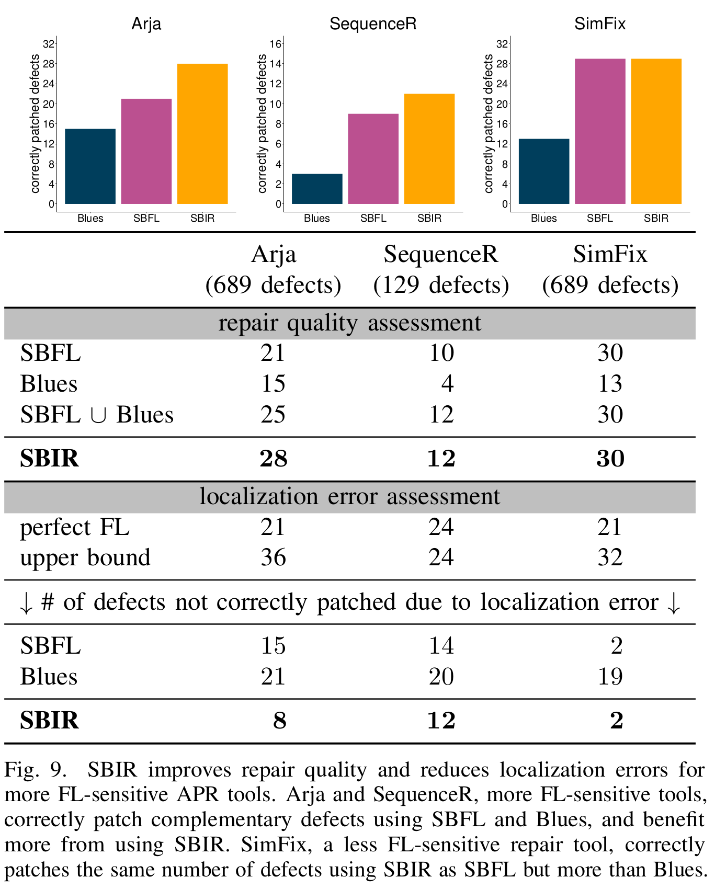

To replicate the above results on the VM, please execute the following commands.

1. `cd /home/sbir/SBIR-ReplicationPackage/AutomatedProgramRepair/`
2. `bash src/compareAPRquality.sh data/patches/`

The output will be printed on the terminal as shown below.

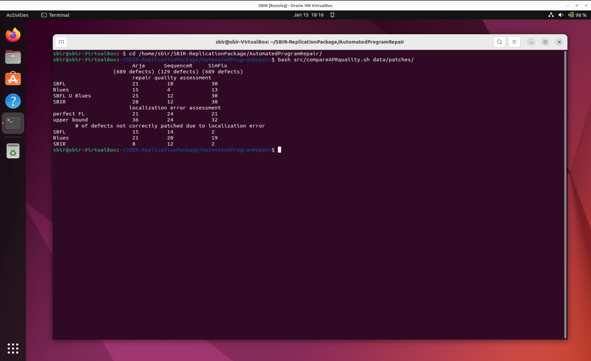

**This replicates the results presented in the Figure 9 of the paper.** 
